# Git Project

<div align="center">

[](https://nestjs.com/)
[](https://www.typescriptlang.org/)
[](https://www.postgresql.org/)
[](https://bun.sh/)

A modern Git repository management system built with NestJS, featuring user authentication, email verification, and repository operations.

</div>

---

## 📋 Table of Contents

- [Features](#-features)
- [Tech Stack](#-tech-stack)
- [Prerequisites](#-prerequisites)
- [Installation](#-installation)
- [Configuration](#-configuration)
- [Running the Application](#-running-the-application)
- [API Documentation](#-api-documentation)
- [Testing](#-testing)
- [Project Structure](#-project-structure)
- [License](#-license)

---

## ✨ Features

- **User Authentication & Authorization**
  - JWT-based authentication
  - Secure password hashing with bcrypt
  - Email verification system

- **Repository Management**
  - Git repository operations using simple-git
  - Repository creation and management
  - File upload support with multer

- **Email Service**
  - Email verification codes
  - Nodemailer integration

- **API Documentation**
  - Swagger/OpenAPI integration
  - Interactive API documentation

---

## 🏗 System Architecture

> 💡 **Interactive Diagrams Available!**
> - **Simple Version**: [`docs/architecture-simple.drawio`](./docs/architecture-simple.drawio) - Clean overview (recommended for presentations)
> - **Detailed Version**: [`docs/system-architecture.drawio`](./docs/system-architecture.drawio) - Full architecture with all layers
>
> Open these files in [draw.io](https://app.diagrams.net/) to view and edit beautiful, interactive diagrams!

### High-Level Overview

```mermaid
graph TB
    User[👤 User/Client]
    Frontend[React Frontend<br/>Vite + React]
    Backend[NestJS Backend<br/>Port: 3000]
    DB[(PostgreSQL<br/>Database)]
    Email[📧 SMTP Server<br/>Email Verification]
    GitStorage[📁 Git Repository<br/>Storage]

    User -->|HTTP/HTTPS| Frontend
    Frontend -->|REST API<br/>JWT Auth| Backend
    Backend -->|TypeORM| DB
    Backend -->|Nodemailer| Email
    Backend -->|Simple-git| GitStorage

    subgraph "Client Layer"
        User
        Frontend
    end

    subgraph "Server Layer"
        Backend
        DB
        GitStorage
    end

    subgraph "External Services"
        Email
    end

    style Backend fill:#e0234e
    style Frontend fill:#61dafb
    style DB fill:#336791
    style Email fill:#ffa500
    style GitStorage fill:#f05032
```



### Key Components

- **Frontend (React)**: User interface built with React and Vite
- **Backend (NestJS)**: RESTful API server with JWT authentication
- **Database (PostgreSQL)**: Stores user data, repositories, and metadata
- **Email Service**: Sends verification codes via SMTP
- **Git Storage**: Manages repository files using simple-git

### Detailed Architecture


### Authentication Flow


### Git Operations Flow


### AI Conflict Resolution Flow


---

## 🛠 Tech Stack

### Core Framework
- **[NestJS](https://nestjs.com/)** - Progressive Node.js framework
- **[TypeScript](https://www.typescriptlang.org/)** - Type-safe JavaScript

### Database & ORM
- **[PostgreSQL](https://www.postgresql.org/)** - Relational database
- **[TypeORM](https://typeorm.io/)** - TypeScript ORM

### Authentication
- **[Passport](http://www.passportjs.org/)** - Authentication middleware
- **[JWT](https://jwt.io/)** - JSON Web Tokens
- **[bcrypt](https://github.com/kelektiv/node.bcrypt.js)** - Password hashing

### Tools & Utilities
- **[Simple Git](https://github.com/steveukx/git-js)** - Git operations
- **[Nodemailer](https://nodemailer.com/)** - Email sending
- **[Multer](https://github.com/expressjs/multer)** - File uploads
- **[Swagger](https://swagger.io/)** - API documentation
- **[Bun](https://bun.sh/)** - Fast JavaScript runtime & package manager

---

## 📦 Prerequisites

Before you begin, ensure you have the following installed:

- **Bun** >= 1.0.0 ([Installation guide](https://bun.sh/docs/installation))
- **Node.js** >= 18.0.0
- **PostgreSQL** >= 14.0

---

## 🚀 Installation

1. **Clone the repository**
   ```bash
   git clone <repository-url>
   cd git-project
   ```

2. **Install dependencies**
   ```bash
   bun install
   ```

---

## ⚙️ Configuration

1. **Create environment file**
   ```bash
   cp .env.example .env
   ```

2. **Configure environment variables**
   ```env
   # Database
   DB_HOST=localhost
   DB_PORT=5432
   DB_USERNAME=your_username
   DB_PASSWORD=your_password
   DB_DATABASE=your_database

   # JWT
   JWT_SECRET=your_jwt_secret
   JWT_EXPIRATION=3600

   # Email
   SMTP_HOST=smtp.example.com
   SMTP_PORT=587
   SMTP_USER=your_email
   SMTP_PASS=your_password
   ```

---

## 🏃 Running the Application

### Development Mode
```bash
bun run start:dev
```

### Production Mode
```bash
# Build the application
bun run build

# Start production server
bun run start:prod
```

### Debug Mode
```bash
bun run start:debug
```

The application will be available at `http://localhost:3000`

---

## 📚 API Documentation

Once the application is running, access the interactive API documentation:

- **Swagger UI**: `http://localhost:3000/api`

---

## 📁 Project Structure

```
git-project/
├── src/
│   ├── app.module.ts          # Root application module
│   ├── main.ts                # Application entry point
│   ├── auth/                  # Authentication module
│   │   ├── auth.controller.ts
│   │   ├── auth.service.ts
│   │   └── auth.module.ts
│   ├── users/                 # Users module
│   │   ├── users.controller.ts
│   │   ├── users.service.ts
│   │   └── users.module.ts
│   ├── repos/                 # Repositories module
│   │   ├── repos.controller.ts
│   │   ├── repos.service.ts
│   │   └── repos.module.ts
│   ├── email/                 # Email service module
│   │   ├── email.service.ts
│   │   └── email.module.ts
│   └── common/                # Shared utilities
├── test/                      # Test files
├── dist/                      # Compiled output
└── package.json
```

---

## 🛠 Development Tools

### Code Formatting
```bash
bun run format
```

### Linting
```bash
bun run lint
```

### Build
```bash
bun run build
```

---

## 📝 License

This project is [UNLICENSED](LICENSE).

---

## 🤝 Contributing

Contributions, issues, and feature requests are welcome!

